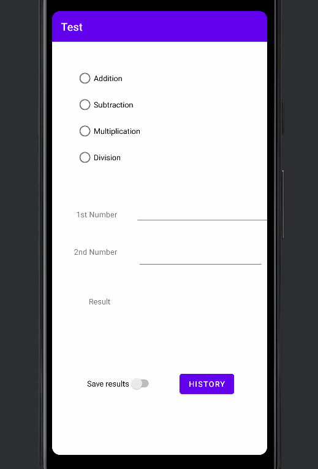
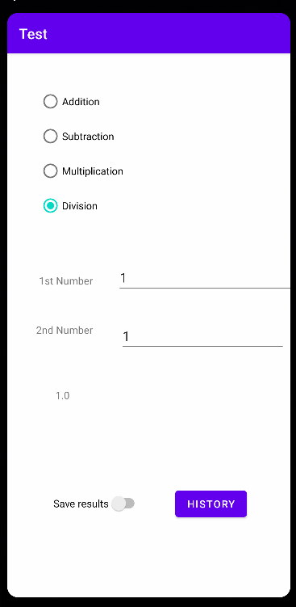
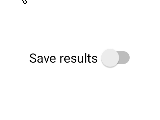

# Calculator_Kotlin
Technologie und Planung

## Prerequisites
* [Android Studio](https://developer.android.com/studio)

## Solution approach

Als aller erstes werden alle Buttons, Views, etc initzialisiert
```
val radioGroup = findViewById<RadioGroup>(R.id.radioGroup)
val input1 = findViewById<TextView>(R.id.nr1)
val input2 = findViewById<TextView>(R.id.nr2)
val switch = findViewById<Switch>(R.id.switch1)
val button = findViewById<Button>(R.id.button)
```
Die Globale Variablen:

```
private var id: Int = 0 //id to get the selected radio-button from the radio-group
private var list = arrayListOf<String>() //each calculation is in a ArrayList saved
private var sw_save: Boolean = false 
```
Die Funktion **onActions** ist für die Interaktion mit verschiedenen Schaltflächen, Schaltern, TextViews ... zuständig. 

* Jedes Mal, wenn Sie einen Radio-Button oder einen TextInput drücken, wird die **Operation()** Funktion aufgerufen.
* Mit **radioGroup.chechRadioButtonid** können Sie herausfinden, welcher Radiobutton ausgewählt wurde.
* Wenn die Schaltfläche "Historie" angeklickt wird, dann wird zum zweiten Bildschirm gesprungen und alle berechneten Listendaten werden zusammen mitgesendet + ob der Switch-Save-Result aktiviert ist 

```
 private fun onActions(radioGroup: RadioGroup, input1: TextView, input2: TextView, switch: Switch, button: Button) {
        //History-Button
        button.setOnClickListener{
            val intent = Intent(this, MainActivity2::class.java)
            intent.putExtra("data", list)
            intent.putExtra("sw_save", sw_save)
            startActivity(intent)
        }

        //setOnAction...
        switch.setOnCheckedChangeListener{_, isChecked ->
            sw_save = isChecked
        }
        radioGroup.setOnCheckedChangeListener { _, _ ->
            id = radioGroup.checkedRadioButtonId
            operation()
        }

        input1.setOnFocusChangeListener { _, _ ->
            operation()
        }
        input2.setOnFocusChangeListener { _, _ ->
            operation()
        }
    }
```
Der **when**-Case von der **operation()**-Funktion wird verwendet, um die gewünschte Operation herauszufinden. Alles ist in einem **try-catch** verschachtelt, da nicht immer eine Zahl in ein Eingabefeld eingegeben wird.

```
 private fun operation() {
        val result = findViewById<TextView>(R.id.res)
        var res = 0.0
        try {
            when (findViewById<RadioButton>(id).text) {
                "Addition" -> {
                    res = findViewById<TextView>(R.id.nr1).text.toString().toDouble() + findViewById<TextView>(R.id.nr2).text.toString().toDouble()
                    save("+", res)
                }
                ...
            }
            //print result
            result.text = res.toString()
        } catch (e: Exception) {
            println(e)
        }
```
Wenn der Switch-Button aktiviert ist, wird das Ergebnis in die Liste hinzugefügt.

```
 private fun save(s: String, res: Double) {
        if (sw_save){
            list.add(findViewById<TextView>(R.id.nr1).text.toString() + s + findViewById<TextView>(R.id.nr2).text.toString() + " = " + res.toString())
        }
    }
```

## How to use

Wählen Sie eine Operation aus und geben Sie zwei Zahlen ein.





## Features


### Save Result



Auf Bedarf können Sie ihre Ergebnisse speichern, indem Sie auf "Save Result" klicken.

### See Results


Um die Ergebnisse zu sehen, können sie auf dem Button "History" klicken.

